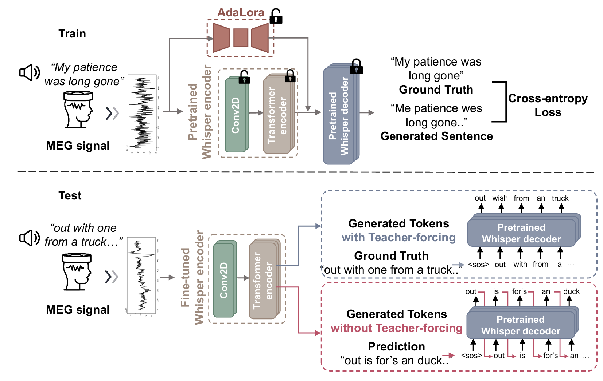

# NeuSpeech: Decode Neural signal as Speech
paper at https://arxiv.org/abs/2403.01748

how to run the code?
1. preprocess data with process_dataset/gwilliams2023_process.py and process_dataset/schoffelen_process.py
2. run the training with python finetune.py, cmd examples in commands/run_gwilliams.sh commands/run_schoffelen.sh
3. run evaluation with python evaluation.py

# contact
please do not hesitate to send me email and start collaboration with us
yyang937@connect.hkust-gz.edu.cn

Thanks yeyupiaoling for finetuning whisper pipeline https://github.com/yeyupiaoling/Whisper-Finetune
